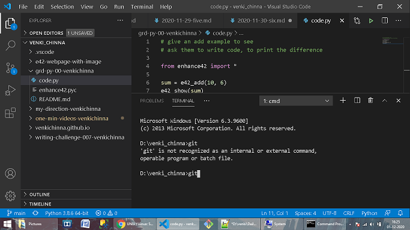
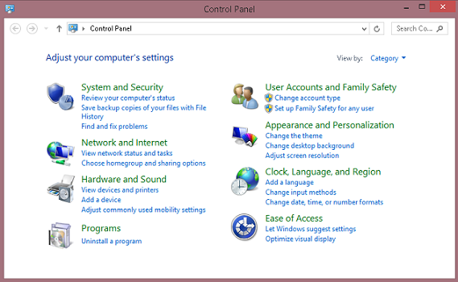
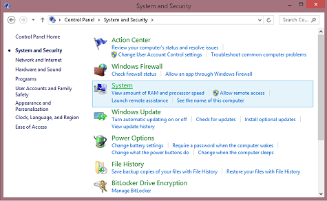
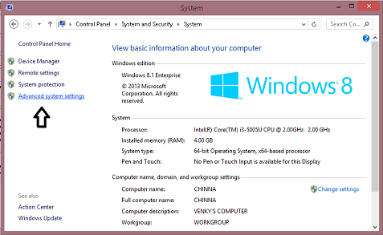
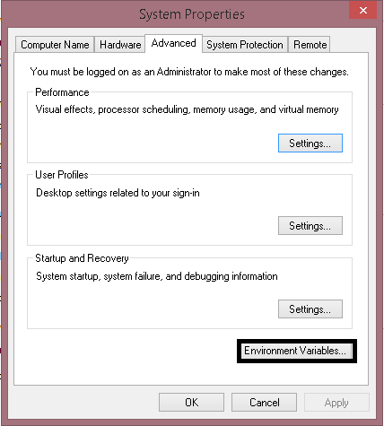
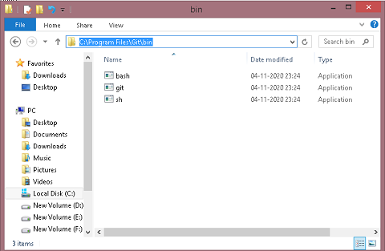
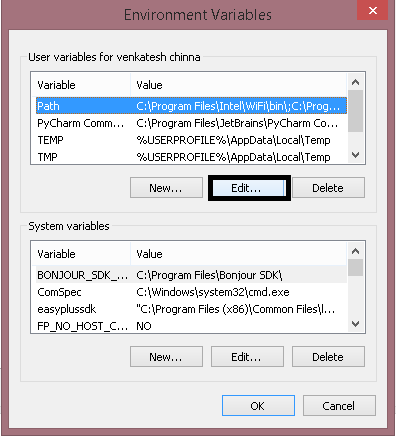
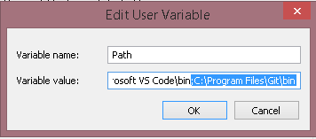
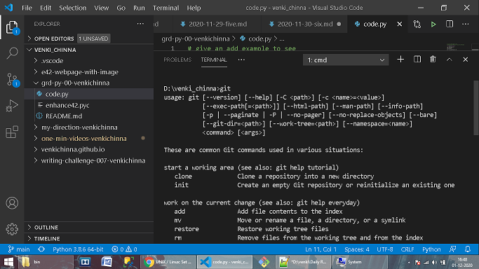

# Here is one Example

_When your VS Code Terminal or Command Prompt is not Recognized you Git Command's_    
  

**_When your VS Code Terminal or Command Prompt is not Recognized you Git Command's Do Follow Below Steps:-_**

1. Open Control panel    
   

2. Select System and Security in the control panel     
     

3. After Selecting System and Security, choose the SYSTEM option.    
     

4. In the System window, click the Advanced system settings link in the left navigation pane.      
    

5. In the System Properties window, click the Environment Variables button near the bottom of that tab.     
  

6. In New Window Goto C drive >> Program Files >> Select Git folder >>Select Bin>> copy the path of your Present Working Window "C:\Program Files\Git\bin"      
     

7. Goto Environment Variables window, highlight the Path variable in the System variables section and click the Edit button and Paste the copied path of Your GIT(Make sure that You have to separate the Directory by adding " ; " before the path).  
    

8. Click 'ok'   

Restart your VS Code.     
Now VS code will Recognise/Take you git commands.      
    
